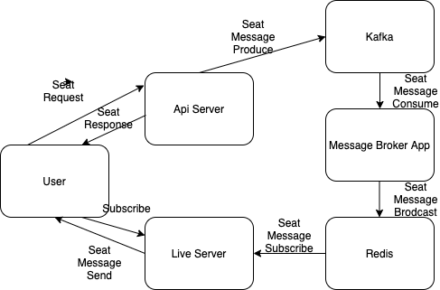

# 실시간 예매 프로젝트

실시간 서비스의 구조를 공부하기 위한 프로젝트입니다

## Tech

### Lang

- Node js 

### Infra

- Docker  

### DB

- Redis  

### MESSAGING

- Redis PUB/SUB 
- Kafka

## Architecture

### api_server

- 좌석 예매, 예매 취소, 좌석 선택, 선택 취소를 간단한게 rest api 로 구현 

- 위 이벤트 발생 시 kafka 통해 meesage_broker_app 으로 message produce

### message_broker_app

- kafka consumer app  

- 메세지 소비하고 Redis pub 을 통해 구독중인 tikieting_live_server 프로세스들에게 publish 하여 브로드캐스팅 하기 위함

### tiketing_live_server

- web socket 을 통한 실시간 통신 서버
- 사용자를 구독 id 로 나누어 수신 받을 메세지를 구분
- redis sub을 통해 메시지를 받고 구독 id를 통해 소켓 구분하여 메세지 송신

