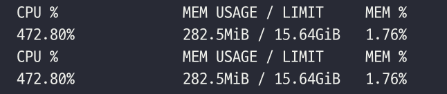
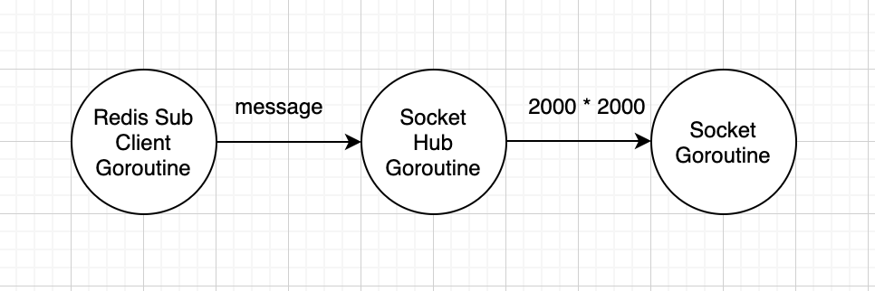
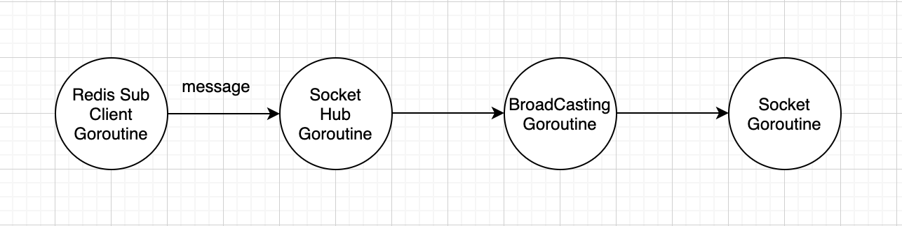
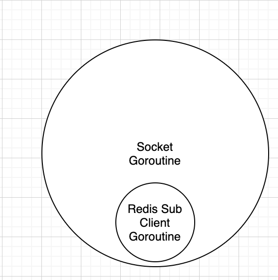
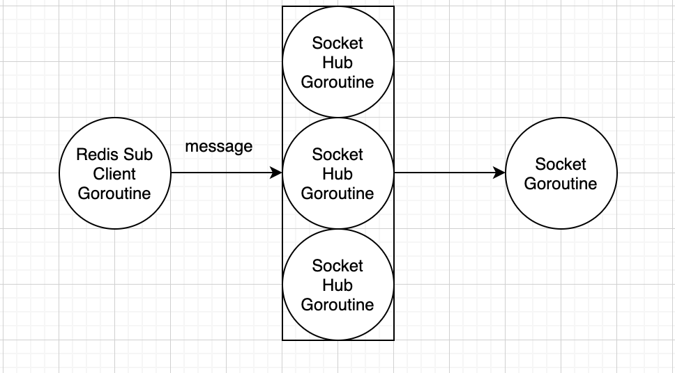

# 웹소켓 서버 퍼포먼스 테스트

- 단순하게 속도 테스트를 하고 싶었다. 
- 테스트를 위해 n 개의 소켓을 열었을 때 m 개의 메세지를 보내는 기준을 잡았다. 그래서 2000개의 동시 연결, 2000개의 메세지를 기준으로 잡았다.
- 테스트 툴은 artillery.io, ws-test2.yml
- 테스트 방법은 2000개 연결 후 레디스에 2000개 메세지 publish
- 테스트 측정은 간단하게 브라우저에서 2000개 메세지를 받기 까지의 시간 측정
- 테스트 기기는 맥뿍, 4core * 2, 16GB

## #1 node server cluster 4
- 4개의 node server 클러스터
- pm2로 동작한다.
- 결과는 평균 48000ms

## #2 node server cluster 8
- 최대 가능 수인 8개로 돌려봤따
- 평균 43000ms 5초 정도 줄었따.
- docker 사용량

- 8개로 돌려도 생각 외로 좋아지지는 않았다.

## 생각...
- 아쉬움..
- 다른 언어로 작성해보자! 라는 생각이 들었다.
- Goroutine을 사용하면 어떻게 될까 라는 궁금증이 생겼다.
- Go 와 Gorilla를 이용하여 서버하나 만들었다.

## #3 Go server
- 똑같이 Redis sub으로 브로드캐스트
- Gorilla Example 에서 수정하여 만들었다.

- 평균 53000ms
- 채널의 버퍼사이즈를 늘려보았다.
- 평균 48000ms

## #4 Go server 2
- 이번엔 메세지를 받았을 경우 브로드캐스팅 하는 것을 고루틴으로 만들어 보았다.

- 평균 23000ms
- 단점이 있었다.
- 메세지의 순서가 지켜지지 않는다.

## #5 Go server 3
- 극단적으로 소켓에 레디스 클라이언트를 생성하였다.

- 평균 18000ms <- 소켓 연결 정상
- 실험 도중에 소켓 연결이 끊김
- 에러를 안잡아서 그럴 수도 있고, 극단적이여서 그런걸수도...

## #5 Go server 4
- hub를 여러개를 생성하자!

- 평균 21000ms

## 고찰
- Go 빠르다
- 연결 소켓을 분리하는게 중요...
- node 더 좋게 하는 방법 없을까..
